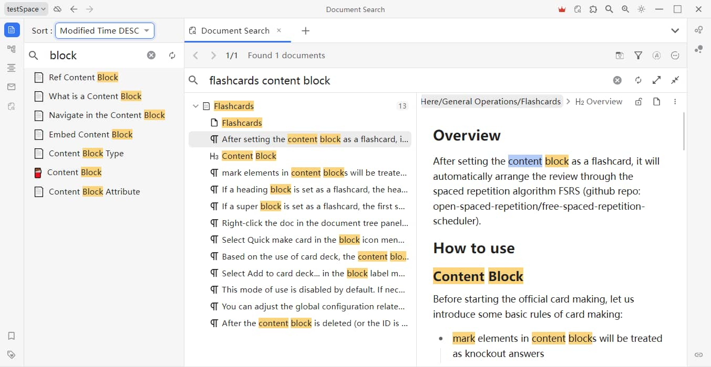

# 基于文档搜索

* 当前不足
  * 预览框无法高亮显示
  * 不支持类型选择
    * 目前默认选择块类型： 文档, 标题, 代码块, 数学公式块, 表格块, 段落块, html块
  * 不支持选择排序方式
    * 目前默认 块类型 > 关联度（内容块与关键词的匹配次数） > 更新时间（最近更新的在前面）
  * 缺少默认展开、折叠笔记本配置
    * 目前默认展开笔记本，如果搜索结果大于500条会全部折叠
  * 不支持匹配条数显示和分页展示
  * 缺少异步幂等性
    * 当查询大数据时，接口还没响应。此时修改查询条件会发起新的接口立马响应，可能被前一次覆盖。
    